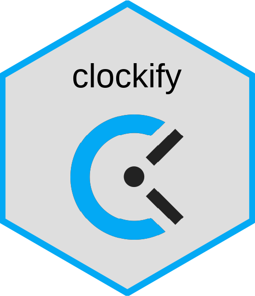

<!-- README.md is generated from README.Rmd. Please edit that file -->

```{r setup, include=FALSE}
knitr::opts_chunk$set(comment = NA)

library(dplyr)
```

# clockify 

<!-- badges: start -->
[](https://cran.r-project.org/package=clockify)
[](https://app.codecov.io/github/datawookie/clockify)
[](https://lifecycle.r-lib.org/articles/stages.html)<!-- badges: end -->

An R wrapper around the [Clockify API](https://docs.clockify.me/).

The documentation for `{clockify}` is hosted at https://datawookie.github.io/clockify/.

## API Key

You're going to need to have an API key from your Clockify account. If you don't yet have an account, create one. Then retrieve the API key from the [account settings](https://clockify.me/user/settings).

## Get Started

The first thing you'll need to do is set up your API key. I store mine in an environment variable called `CLOCKIFY_API_KEY`.

<!-- Use API key from demo account. -->

```{r get-api-key}
CLOCKIFY_API_KEY <- Sys.getenv("CLOCKIFY_API_KEY")
```

Now load the `{clockify}` package and specify the API key.

```{r set-api-key}
library(clockify)

set_api_key(CLOCKIFY_API_KEY)
```

Let's turn on some logging so we can see what's happening behind the scenes.

```{r enable-logging}
library(logger)

log_threshold(INFO)
```
```{r include=FALSE}
log_appender(appender_stdout)
log_layout(layout_glue_generator(format = "{time} — {msg}"))
```

## Workspaces

Retrieve a list of available workspaces.

```{r get-all-workspaces}
workspaces()
```

Select a specific workspace.

```{r set-workspace}
workspace("630c61ba9c3a3c3112812332")
```

## Users

Retrieve information on your user profile.

```{r get-user}
user()
```

Get a list of users.

```{r get-all-users}
users()
```

## Clients

Get a list of clients.

```{r get-clients}
clients()
```

## Projects

Get a list of projects.

```{r get-projects}
projects()
```

## Time Entries

### Retrieve Time Entries

Retrieve the time entries for the authenticated user.

```{r get-all-time-entries, eval=FALSE}
time_entries()
```

Retrieve time entries for another user specified by their user ID.

```{r get-user-time-entries, eval=FALSE}
time_entries(user_id = "630f15d3b59c366b0e3ae2e6")
```

### Insert Time Entry

```{r put-time-entries}
prepare_cran_entry <- time_entry_create(
  project_id = "630ce53290cfd8789366fd49",
  start = "2021-08-30 08:00:00",
  end = "2021-08-30 10:30:00",
  description = "Prepare for CRAN submission"
)
```

Check on the ID for this new time entry.

```{r get-time-entry-id}
prepare_cran_entry$time_entry_id
```

Confirm that it has been inserted.

```{r check-insert-time-entry, concise = FALSE}
time_entries(concise = FALSE) %>%
  select(time_entry_id, description, time_start, time_end)
```

### Delete Time Entry

```{r delete-time-entry}
time_entry_delete(prepare_cran_entry$time_entry_id)
```

Confirm that it has been deleted.

```{r check-delete-time-entry, concise = FALSE}
time_entries(concise = FALSE) %>%
  select(time_entry_id, description, time_start, time_end)
```

## Endpoints

<!-- This list generated by api-get-endpoints.R. -->

Endpoints which have currently been implemented in this package. Endpoints which are only available on a paid plan are indicated with a 💰.

- [X] GET /workspaces/{workspaceId}/clients
- [X] POST /workspaces/{workspaceId}/clients
- [X] PUT /workspaces/{workspaceId}/clients/{clientId}
- [X] DELETE /workspaces/{workspaceId}/clients/{clientId}
- [X] GET /workspaces/{workspaceId}/projects
- [X] GET /workspaces/{workspaceId}/projects/{projectId}
- [X] POST /workspaces/{workspaceId}/projects
- [X] PUT /workspaces/{workspaceId}/projects/{projectId}
- [X] PUT /workspaces/{workspaceId}/projects/{projectId}/users/{userId}/hourly-rate
- [X] PUT /workspaces/{workspaceId}/projects/{projectId}/users/{userId}/cost-rate
- [X] PATCH /workspaces/{workspaceId}/projects/{projectId}/estimate
- [X] PATCH /workspaces/{workspaceId}/projects/{projectId}/memberships
- [X] PATCH /workspaces/{workspaceId}/projects/{projectId}/template
- [X] DELETE /workspaces/{workspaceId}/projects/{id}
- [X] GET /workspaces/{workspaceId}/tags
- [X] GET /workspaces/{workspaceId}/tags/{tagId}
- [X] POST /workspaces/{workspaceId}/tags
- [X] PUT /workspaces/{workspaceId}/tags/{tagId}
- [X] DELETE /workspaces/{workspaceId}/tags/{tagId}
- [X] GET /workspaces/{workspaceId}/projects/{projectId}/tasks
- [X] GET /workspaces/{workspaceId}/projects/{projectId}/tasks/{taskId}
- [X] POST /workspaces/{workspaceId}/projects/{projectId}/tasks
- [X] PUT /workspaces/{workspaceId}/projects/{projectId}/tasks/{taskId}
- [X] PUT /workspaces/{workspaceId}/projects/{projectId}/tasks/{taskId}/hourly-rate
- [X] PUT /workspaces/{workspaceId}/projects/{projectId}/tasks/{taskId}/cost-rate
- [X] DELETE /workspaces/{workspaceId}/projects/{projectId}/tasks/{taskId}
- [X] GET /workspaces/{workspaceId}/user/{userId}/time-entries
- [X] GET /workspaces/{workspaceId}/time-entries/{id}
- [X] POST /workspaces/{workspaceId}/time-entries
- [X] POST /workspaces/{workspaceId}/user/{userId}/time-entries 💰
- [X] PATCH /workspaces/{workspaceId}/user/{userId}/time-entries 💰
- [X] PUT /workspaces/{workspaceId}/time-entries/{id}
- [X] PATCH /workspaces/{workspaceId}/time-entries/invoiced
- [X] DELETE /workspaces/{workspaceId}/time-entries/{id}
- [X] GET /user
- [X] GET /workspaces/{workspaceId}/users
- [X] POST /workspaces/{workspaceId}/users 💰
- [X] PUT /workspaces/{workspaceId}/users/{userId}
- [X] PUT /workspaces/{workspaceId}/users/{userId}/hourly-rate
- [X] PUT /workspaces/{workspaceId}/users/{userId}/cost-rate
- [X] POST /workspaces/{workspaceId}/users/{userId}/roles
- [X] DELETE /workspaces/{workspaceId}/users/{userId}/roles
- [X] DELETE /workspaces/{workspaceId}/users/{userId}
- [X] GET /workspaces/{workspaceId}/user-groups
- [X] POST /workspaces/{workspaceId}/user-groups
- [X] PUT /workspaces/{workspaceId}/user-groups/{userGroupId}
- [X] DELETE /workspaces/{workspaceId}/user-groups/{userGroupId}
- [X] POST /workspaces/{workspaceId}/user-groups/{userGroupId}/users
- [X] DELETE /workspaces/{workspaceId}/user-groups/{userGroupId}/users/{userId}
- [X] GET /workspaces
- [X] GET /workspaces/{workspaceId}/custom-fields
- [X] GET /workspaces/{workspaceId}/projects/{projectid}/custom-fields
- [X] PATCH /workspaces/{workspaceId}/projects/{projectid}/custom-fields/{customFieldId}
- [X] DELETE /workspaces/{workspaceId}/projects/{projectid}/custom-fields/{customFieldId}
- [X] POST /workspaces/{workspaceId}/reports/summary
- [X] POST /workspaces/{workspaceId}/reports/detailed
- [X] POST /workspaces/{workspaceId}/reports/weekly
- [X] GET /workspaces/{workspaceId}/shared-reports
- [X] GET /shared-reports/{sharedReportId}
- [X] POST /workspaces/{workspaceId}/shared-reports
- [X] PUT /workspaces/{workspaceId}/shared-reports/{sharedReportId}
- [X] DELETE /workspaces/{workspaceId}/shared-reports/{sharedReportId}
